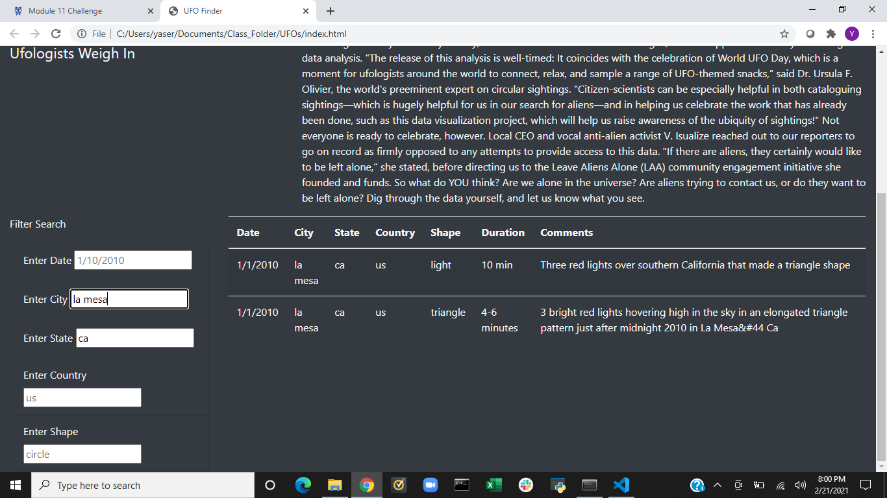
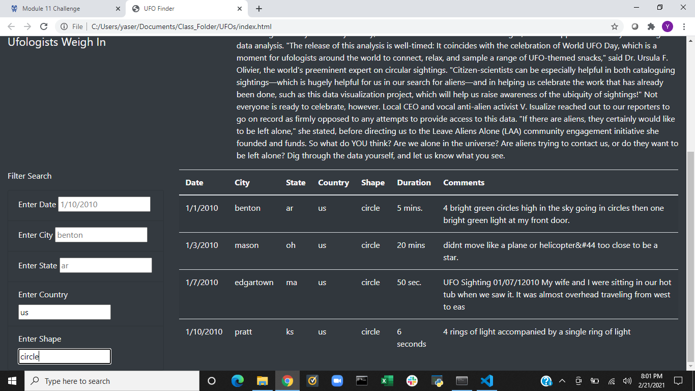

# UFOs
## Overview of Project: 
In this project the main purpose using JavaScript to create a web page that someone can look at UFO sightings. Using JavaScript and Bootstrap we created a webpage to display the information and for someone to filter for specific information. Also, we can see a clear page and some changes to the webpage using bootstrap to make the web app look a lot more visually appealing.
## Results: 
With the webpage you are now able to see the whole table if you want or if you want to filter to see specific results. With the different prompts that you have you can see what the exact information you are looking for. 

In the image above you can see that you can filter through multiple prompts. As you can see in the enter city category, I entered la mesa and for state I entered ca, for California. Once, I entered them in the input box the data filtered and only included the instances where both criteria were met.

In the second image that is above you can see that this also is filtered using two categories, country as us and shape as circle. Again, when these two inputs were entered the data filters to meet where the key/value pairs match. 
## Summary: 
This webpage is functional and can filter the results based upon the criteria that you are looking for. One of the drawbacks of this is that inputs are case sensitive. So, if a word is not entered the way it looks on the data table it will not be found. One case of this is us in the country line will be found however if it was entered as Us, uS, or US it will come up as no data. For further development adding the handle click button would allow the results to show all at once instead of changing every time the new input is entered. Also, we can also make the inputs less case sensitive. If you type in Us or US for it to come on the data table would make it better. So, if someone is searching, they do not think that there is no information on this when there actually may be information on it.
